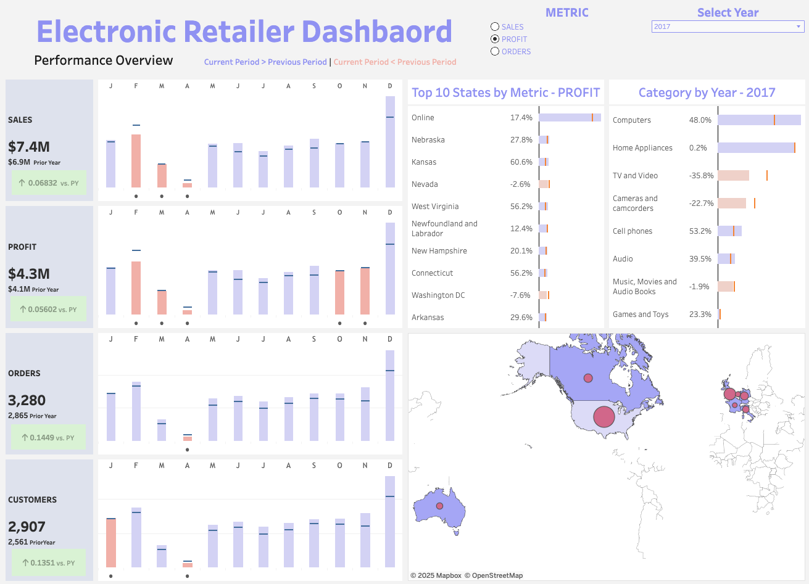

# PredictiveModeling-CustomerBehaviorAnalysis (Python + Tableau)
Predictive modeling project focused on uncovering data-driven insights for a large electronic retailer platform. The project utilizes Python and Tableau to clean, analyze and summarize insights for various stakeholders. 

Tableau Public Dashboard [here](https://public.tableau.com/app/profile/zivko.danicic/viz/RetailerTableau/Dashboard1)
